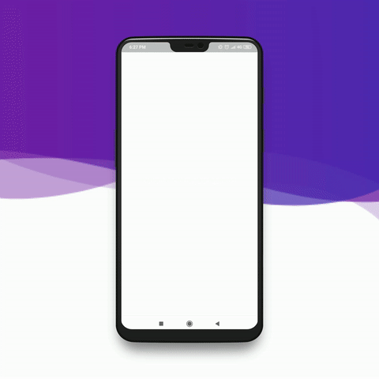

# Flutter Finance App


Finance app is a cloud-enabled, mobile-ready powered flutter application.
# Features!
  - Splash Screen
  - Multi slider stastics updates
  - Finance history using List view
  - Password pin options
  - Validation 

### Application Behaviour


### Tech

Finance app uses a number of open source projects to work properly:

* [Flutter] - Mobile application development framework using Dart!
* [Visual Studio Code] - awesome text editor


### Installation

Finance App requires [Flutter](https://flutter.dev/) v1.0.0+ to run.

Install the dependencies and devDependencies.

```sh
$ flutter packages get
```

Start application...

```sh
$ flutter run
```

### Design Credit

Thanks to 
https://www.behance.net/gallery/68477961/Audit-Finance-App-Concept

### Contact us
We are working on flutter application
Email :- bhavin@saeculumsolutions.com 

### Development

Will work on new updates for complete application.

### Todos

 - Work on extra features
 - Performance improvement

### License
----

MIT


